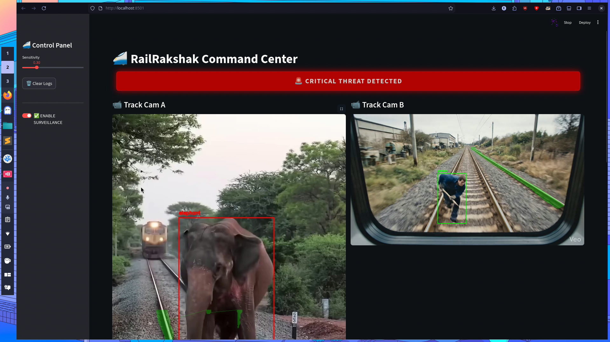

# 🚄 RailRakshak: AI-Powered Autonomous Railway Surveillance


> **"Eyes on the Track, Safety on the Rack."**
> An intelligent, real-time Computer Vision system designed to prevent railway accidents caused by vandalism, unauthorized human access, and wildlife collisions.

---

## 🚨 The Problem
Railway safety is compromised by unauthorized track access, vandalism, and wildlife collisions. Traditional manual monitoring is slow and error-prone.

## 💡 The Solution: RailRakshak
**RailRakshak** is a smart surveillance node deployed on CCTVs or Drones. It acts as a "Third Eye" for the pilot/station master.

### Key Capabilities:
* **🟢 Dynamic Track Segmentation:** Uses a custom trained **YOLOv8-Seg** model to identify the "Safe Zone."
* **🐘 Multi-Class Threat Detection:** Identifies Humans (Vandalism), Elephants, Bears, and Cattle.
* **📐 Geometric Danger Logic:** Calculates if objects are **physically intersecting** the track's danger zone (Buffer +30px).
* **🔊 Instant Alerts:** Triggers visual alarms and audio warnings (Siren/Voice) via Base64 injection.
* **📹 Black Box Recording:** Automatically saves video clips of incidents to `/recordings`.

---

## 🎥 Demo


---

## 🛠️ Installation & Setup

### 1. Clone the Repository
```bash
git clone [https://github.com/YOUR_USERNAME/RailRakshak.git](https://github.com/YOUR_USERNAME/RailRakshak.git)
cd RailRakshak

```

### 2. Install Dependencies

```bash
pip install -r requirements.txt

```

### 3. 📥 Download Assets (CRITICAL)

Due to file size limits, the AI Models and Data are hosted externally.

| Asset Type | Description | Download Link |
| --- | --- | --- |
| **🧠 AI Model** | `track_model.pt` (Custom Binary) | **[Download from Github Releases](https://github.com/threed2y/railway-tampering-system/releases/tag/v1.0)** |
| **📹 Samples** | Test Videos & Audio Files | **[Download from Google Drive](https://drive.google.com/drive/folders/1tW5DRfj16TILBkI-OCuomfW5hSx5ETj6?usp=drive_link)** |
| **📊 Dataset** | Training Data (Images/Labels) | **[View on Hugging Face](https://huggingface.co/datasets/sleepysaurus/RailRakshak-Track-Detection-Data)** |

### 4. Organize Files

Place the downloaded files as shown below.
*(Note: The system uses a recursive search, so as long as files are inside the project, it will work!)*

```text
railway-tampering-system/
│
├── track_model.pt            <-- 🚨 PASTE MODEL HERE
├── requirements.txt
├── README.md
│
└── vision_module/
    ├── app.py                # Main Application
    │
    ├── assets/
    │   ├── danger.mp3        # 🚨 PASTE AUDIO HERE
    │   └── warning.mp3
    │
    └── data/
        └── samples/
            ├── test.mp4      # 🚨 PASTE VIDEOS HERE
            └── Test2.mp4

```

### 5. Launch the Dashboard

```bash
streamlit run vision_module/app.py

```

---

## 🧠 How It Works (The Math)

1. **Segmentation:** The system predicts a polygon mask for the railway track.
2. **Buffering:** We apply a `Buffer(+30px)` to this polygon to create a "Danger Zone."
3. **Intersection over Union (IoU):**
* **Humans (Class 0):** Trigger ALERT at **1% overlap** (High sensitivity for vandalism).
* **Elephants/Animals:** Trigger ALERT at **10% overlap**.


4. **Feedback Loop:** If status is "DANGER", the system locks the frame, writes it to disk, and plays the audio alert.

---

## 🏆 Team

* **Developer:** Ethan Hunt
* **Role:** AI & Machine Learning
* **Team:** RAT

---

*Built with sheer fking will*


